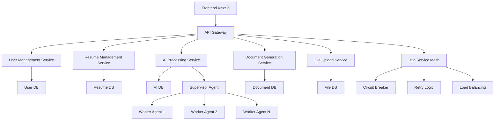

# Architecture Overview

## Current Microservices Architecture

The CareerVerve application follows a microservices architecture designed for scalability, resilience, and maintainability. Each logical unit operates as an independent service with its own database, API, and deployment lifecycle, orchestrated via Kubernetes with Istio service mesh.

### Key Components

- **Frontend Layer**: React-based UI with Next.js App Router, featuring components for resume building, internationalization, state management via Zustand, and AdComponent for privacy-compliant advertisement serving.
- **Microservices Layer**: Independent services handling specific business domains:
  - **User Management Service**: Handles user authentication, profiles, and consent management.
  - **Resume Management Service**: Manages resume creation, storage, templates, and document generation.
  - **AI Processing Service**: Provides AI-powered linting, rewriting, and suggestions for resumes and cover letters.
  - **Document Generation Service**: Handles PDF and DOCX generation and export operations.
  - **File Upload Service**: Manages secure file uploads, parsing, and storage.
- **API Gateway**: Nginx-based gateway for routing, authentication, and rate limiting across services.
- **Service Mesh**: Istio for inter-service communication, circuit breakers, and observability.
- **Database Layer**: Separate MongoDB instances per service with encryption for sensitive fields.
- **Authentication**: JWT-based authentication with OAuth providers via User Management Service.
- **Ad Service**: Distributed ad serving with privacy-focused metrics collection.
- **Testing**: Jest for unit/integration tests, Playwright for e2e tests, contract testing for service interfaces.
- **Deployment**: Containerized services deployed via Kubernetes with Helm charts.

### Actor System Design

The system implements agentic design patterns using a hierarchical supervisor-worker architecture for AI operations and complex workflows:

#### Supervisor-Worker Pattern
- **Supervisor Agents**: Orchestrate complex tasks, delegate work to worker agents, handle failures, and ensure task completion.
- **Worker Agents**: Execute specific operations (AI processing, document generation, data validation).
- **Communication**: Event-driven messaging via RabbitMQ with correlation IDs for request tracing.
- **Resilience**: Supervisor agents implement retry logic, circuit breakers, and escalation paths for uncertain cases.

#### Multi-Agent Collaboration (A2A/MCP)
- **Agent-to-Agent Protocols**: Secure inter-agent communication using standardized protocols.
- **Task Delegation**: Hierarchical delegation for complex operations (e.g., AI processing delegates to specialized sub-agents).
- **Oversight Boundaries**: Agents escalate uncertain cases to human operators with guardrails and audit trails.

### Resilience Features

#### Circuit Breakers
- **Implementation**: Hystrix-style circuit breakers in Istio service mesh.
- **Configuration**: Automatic failure detection with configurable thresholds (failure rate > 50% triggers open state).
- **Recovery**: Half-open state testing, automatic recovery when service health improves.

#### Retry Mechanisms
- **Exponential Backoff**: Configurable retry policies with jitter to prevent thundering herd.
- **Idempotency**: Request deduplication using correlation IDs.
- **Timeout Handling**: Service-level timeouts with graceful degradation.

#### Failure Isolation
- **Bulkheads**: Resource isolation per service to prevent cascade failures.
- **Graceful Degradation**: Services continue operating with reduced functionality during partial failures.
- **Fallback Strategies**: Cached responses or simplified operations during service unavailability.

### Data Flow

1. User interacts with frontend components.
2. Frontend calls API Gateway with authenticated requests.
3. API Gateway routes to appropriate microservice.
4. Service processes request, potentially coordinating with other services via service mesh.
5. Responses flow back through the same path with correlation IDs for tracing.
6. Actor system handles complex operations with supervisor-worker delegation.

### Strengths

- Improved fault isolation and scalability.
- Independent service deployment and scaling.
- Technology diversity per service requirements.
- Enhanced resilience through distributed architecture.

### Limitations

- Increased complexity in orchestration and communication.
- Data consistency challenges across services.
- Higher operational overhead and monitoring requirements.
- Distributed transaction management complexity.

## Microservices Implementation

To address scalability, maintainability, and resilience, the architecture will evolve into a microservices-based system. Each logical unit will be an independent service with its own database, API, and deployment, orchestrated via Kubernetes.

### Implemented Microservices

- **User Management Service**: Manages user authentication, profiles, consent management, and OAuth providers.
- **Resume Management Service**: Handles resume creation, storage, retrieval, template management, and document generation (PDF, DOCX).
- **AI Processing Service**: Provides AI-powered linting, rewriting, and suggestions for resumes and cover letters using agentic design patterns.
- **Document Generation Service**: Generates and manages cover letters and documents, with PDF export capabilities.
- **File Upload Service**: Handles secure file uploads, parsing (PDF, DOCX), and import/export operations.
- **API Gateway**: Nginx-based routing, authentication, and rate limiting across services.
- **Shared Libraries**: Common utilities (validations, error handling) as shared packages.

### Architecture Diagram

### Key Principles

- **Service Independence**: Each microservice has its own database and deployment, avoiding shared state and tight coupling.
- **API-First Design**: Services expose RESTful APIs with semantic versioning for backward compatibility.
- **Resilience**: Istio service mesh implements circuit breakers, retries, and failure isolation.
- **Scalability**: Kubernetes Horizontal Pod Autoscaler (HPA) based on CPU/memory metrics.
- **Observability**: Centralized logging with correlation IDs, Prometheus/Grafana metrics, and health checks.
- **Agentic Design**: Hierarchical supervisor-worker patterns for AI operations with escalation paths.
- **Security-First**: Input validation, least privilege access, and secrets management across all services.

### Service Implementation Details

#### Service Architecture
Each microservice follows a consistent internal structure:
- **API Layer**: Express.js REST APIs with input validation and error handling.
- **Business Logic**: Service-specific logic with standardized error codes.
- **Data Layer**: Mongoose models with encryption for sensitive fields.
- **Health Checks**: `/health` endpoints for Kubernetes liveness/readiness probes.
- **Metrics**: Prometheus-compatible `/metrics` endpoints.

#### Database Design
- **DB-First Approach**: Database schemas defined before API implementation.
- **Independent Databases**: Each service owns its data domain completely.
- **Encryption**: Sensitive fields encrypted at rest using AES-256.
- **Migrations**: Version-controlled migration scripts with rollback capabilities.

#### API Design
- **Semantic Versioning**: APIs versioned as `/v1/`, `/v2/` with backward compatibility.
- **RESTful Design**: Standard HTTP methods with consistent response formats.
- **Documentation**: OpenAPI/Swagger specs for all service APIs.
- **Deprecation**: Graceful API deprecation with sunset headers and migration guides.

#### Inter-Service Communication
- **Service Mesh**: Istio handles service discovery, load balancing, and resilience.
- **Protocols**: REST for external APIs, gRPC for internal high-performance calls.
- **Authentication**: JWT tokens with service-specific scopes and permissions.
- **Correlation IDs**: Request tracing across service boundaries.

#### Deployment and Scaling
- **Containerization**: Docker containers with multi-stage builds for optimization.
- **Orchestration**: Kubernetes deployments with Helm charts.
- **Auto-Scaling**: HPA based on CPU utilization (target: 70%) and custom metrics.
- **Resource Limits**: Configured requests/limits to ensure predictable performance.

### Service Boundaries and Communication Patterns
- **Boundaries**: Each service owns its domain data and logic completely. No shared databases; all data access through service APIs.
- **Communication Patterns**:
    - Synchronous: REST APIs for real-time operations (e.g., User Management Service validates tokens for Resume Service).
    - Asynchronous: RabbitMQ message queues for events (e.g., AI Processing Service publishes completion events).
    - Event-Driven: Publish-subscribe patterns for decoupled interactions between services.
    - Agent-to-Agent: MCP protocols for secure AI agent collaboration within and across services.

### Benefits

- Improved fault isolation and scalability.
- Parallel development and deployment.
- Easier maintenance and updates per service.

### Challenges

- Increased complexity in orchestration and inter-service communication.
- Data consistency across services.
- Higher operational overhead.

## Ethical Considerations

- **Privacy**: Microservices architecture enables granular data isolation, minimizing breach impact. Each service implements encryption for sensitive fields and maintains independent audit trails. AI processing uses differential privacy techniques to protect user data during model training and inference.
- **Fairness**: AI agents implement fairness constraints and bias detection. Multi-agent systems include oversight mechanisms to prevent discriminatory outcomes. Ad serving algorithms avoid targeting based on protected characteristics and maintain demographic neutrality.
- **Data Minimization**: Services follow data minimization principles, collecting only essential data for their functions. User data retention policies include automatic deletion schedules. AI agents use federated learning approaches to minimize centralized data collection.
- **Transparency**: Agent capabilities, limitations, and decision-making processes are documented and auditable. Users receive explanations for AI-generated content and recommendations.
- **Human Oversight**: AI agents escalate uncertain cases to human operators through defined guardrails. Multi-agent collaboration includes human-in-the-loop validation for critical decisions.
- **Accountability**: All agent actions are logged with correlation IDs for traceability. Service independence ensures accountability per domain without cross-contamination.
- **User Consent**: Granular consent management across services with clear opt-in/opt-out mechanisms. AI features require explicit user consent with transparent data usage explanations.

## Compliance Notes

- **Architecture & Design**: Implements microservices with service independence, circuit breakers, Kubernetes auto-scaling, API versioning, DB-first approach, and multi-agent collaboration protocols.
- **Coding Standards**: Centralized validation/error handling, DRY principles, standardized error codes, and LLM-assisted code optimization.
- **Documentation**: Comprehensive service READMEs, architecture overviews, agent capability documentation, and ethical considerations for sensitive data.
- **Testing & Quality**: Contract testing, 80%+ coverage, early V&V, technical debt monitoring, and agent performance benchmarks.
- **Security**: Security-first design, secrets management, vulnerability scanning, AI threat modeling, and regulatory compliance.
- **DevOps & Process**: Docker/Kubernetes orchestration, automated CI/CD, semantic versioning, metrics tracking, and guardrails for AI agents.
- **Observability & Monitoring**: Health endpoints, centralized logging with correlation IDs, Prometheus metrics, and anomaly detection.
- **Configuration & Resource Management**: Environment variable configuration, resource optimization, and cost monitoring.