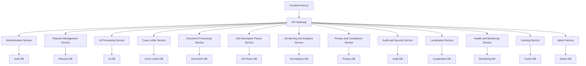

# Architecture Overview

## Current Architecture

The CareerVerve application currently follows a monolithic architecture built on Next.js, integrating frontend, backend, and API layers within a single codebase. This structure supports rapid development and deployment but may limit scalability for growing user bases.

### Key Components

- **Frontend Layer**: React-based UI with Next.js App Router, featuring components for resume building, internationalization, state management via Zustand, and AdComponent for privacy-compliant advertisement serving.
- **Backend Layer**: Server-side logic including Mongoose models for MongoDB, utility libraries for validations and error handling, middleware for security and rate limiting, and ad metrics tracking with user anonymization.
- **API Layer**: Next.js API routes handling authentication (NextAuth), CRUD operations for resumes and cover letters, file uploads, PDF generation using Puppeteer, DOCX import/export using mammoth and docx libraries, and ad metrics tracking and configuration endpoints.
- **Database**: Single MongoDB instance with encryption for sensitive fields, including anonymized ad metrics collections.
- **Authentication**: NextAuth.js for session management and OAuth providers.
- **Ad Service**: Integrated ad serving system with Google AdSense integration, lazy loading, adblock detection, and privacy-focused metrics collection.
- **Testing**: Jest for unit/integration tests, Playwright for e2e tests.
- **Deployment**: Monolithic build and deployment via Next.js.

### Data Flow

1. User interacts with frontend components.
2. Frontend calls API routes.
3. API routes use backend libraries and models to interact with MongoDB.
4. Responses are returned through the API to the frontend.

### Strengths

- Simplified development and debugging.
- Shared codebase for consistency.
- Easy to deploy as a single unit.

### Limitations

- Tight coupling between components.
- Scalability challenges with increasing load.
- Single point of failure for the entire application.

## Future Microservices Plan

To address scalability, maintainability, and resilience, the architecture will evolve into a microservices-based system. Each logical unit will be an independent service with its own database, API, and deployment, orchestrated via Kubernetes.

### Proposed Microservices

- **Authentication Service**: Manages user authentication, session handling, and OAuth providers.
- **Resume Management Service**: Handles resume creation, storage, retrieval, template management, and document generation (PDF, DOCX).
- **AI Processing Service**: Provides AI-powered linting, rewriting, and suggestions for resumes and cover letters.
- **Cover Letter Service**: Generates and manages cover letters, with PDF export capabilities.
- **Document Processing Service**: Handles file uploads, parsing (PDF, DOCX), and import/export operations.
- **Job Description Parser Service**: Parses job descriptions for matching algorithms and insights.
- **Ad Serving and Analytics Service**: Manages advertisement serving, metrics tracking with privacy protection, adblock detection, and ethical ad placement.
- **Privacy and Compliance Service**: Ensures data privacy, consent management, and regulatory compliance.
- **Audit and Security Service**: Handles audit logging, security monitoring, and access controls.
- **Localization Service**: Manages internationalization, locale data, and language support.
- **Health and Monitoring Service**: Provides health checks, centralized logging, and metrics collection.
- **Caching Service**: Manages distributed caching for performance optimization.
- **Admin Service**: Handles administrative functions, settings, and system configuration.
- **API Gateway**: Nginx or Kong for routing, authentication, and rate limiting across services.
- **Shared Libraries**: Common utilities (validations, error handling) as shared packages.

### Architecture Diagram (Conceptual)

### Key Principles

- **Service Independence**: Each microservice has its own database and deployment, avoiding shared state.
- **API-First Design**: Services expose RESTful APIs with versioning for backward compatibility.
- **Resilience**: Circuit breakers (e.g., Hystrix) and retries for fault tolerance.
- **Scalability**: Kubernetes auto-scaling based on load.
- **Observability**: Centralized logging with correlation IDs, metrics via Prometheus/Grafana.
- **Migration Strategy**: Phased rollout with API stubs during transition; DB migrations with rollback plans.

### Detailed Migration Plan

#### Phased Migration Approach
The migration will follow a phased approach starting with less critical services to minimize risk and allow for iterative testing and validation. Each phase includes database migration, API development, deployment, and testing.

1. **Phase 1: Infrastructure and Supporting Services (Weeks 1-4)**
   - Deploy API Gateway, Health and Monitoring Service, Caching Service, and Localization Service.
   - Establish service mesh (Istio) for inter-service communication.
   - Set up centralized logging and monitoring infrastructure.

2. **Phase 2: Security and Compliance Services (Weeks 5-8)**
   - Migrate Privacy and Compliance Service, Audit and Security Service.
   - Implement security-first principles across all services.

3. **Phase 3: Core Business Services (Weeks 9-16)**
   - Migrate Authentication Service, Resume Management Service, Cover Letter Service, Document Processing Service, Job Description Parser Service, AI Processing Service.
   - Ensure API stubs are in place for frontend integration during transition.

4. **Phase 4: Advanced Services (Weeks 17-20)**
   - Migrate Ad Serving and Analytics Service, Admin Service.
   - Finalize frontend integration and remove monolithic dependencies.

#### Database Migration Strategies
Following DB-first approach, each service will have its own MongoDB instance. Migrations will use custom scripts with rollback capabilities.

- **Separate Databases**: Each service gets a dedicated MongoDB database to ensure independence.
- **Migration Scripts**: Use MongoDB migration tools or custom scripts with version control. Each migration includes forward and rollback scripts.
- **Data Migration**: Extract data from monolithic DB using ETL processes, validate integrity, and load into new DBs.
- **Rollback Strategy**: Maintain data snapshots; rollback scripts restore previous state. Parallel run monolithic and microservices during transition.

Example for Resume Management Service:
- Create new DB: `resume_db`
- Migration script: Extract resumes from monolithic DB, transform, load into `resume_db`
- Rollback: Drop `resume_db` and redirect to monolithic DB

#### API Versioning and Inter-Service Communication
- **Versioning**: APIs use semantic versioning (e.g., `/v1/resumes`, `/v2/resumes`). Graceful deprecation with sunset headers.
- **Communication Protocols**: RESTful APIs for external, gRPC for internal efficiency. Service mesh (Istio) for resilience with circuit breakers and retries.
- **Authentication**: JWT tokens via API Gateway for inter-service calls.

#### Deployment and Orchestration
- **Containerization**: Each service in Docker containers.
- **Orchestration**: Kubernetes with Helm charts for deployment.
- **Auto-Scaling**: Horizontal Pod Autoscaler (HPA) based on CPU/memory metrics.
- **Load Balancing**: Kubernetes services with ingress for external access.

#### Testing and Validation Strategies
- **Contract Testing**: Pact or similar for API contracts between services.
- **Integration Testing**: Test inter-service communication and data flow.
- **End-to-End Testing**: Validate full user journeys with microservices.
- **Performance Testing**: Load tests to ensure scalability; benchmarks against SLAs.
- **Validation During Migration**: Canary deployments, feature flags, and A/B testing.

#### Rollback Plans and Risk Mitigation
- **Rollback Plans**: Each phase includes rollback scripts for DB and code. Keep monolithic running in parallel for 4 weeks post-migration.
- **Risk Mitigation**:
  - Data backups before each migration.
  - Monitoring dashboards for anomalies.
  - Gradual traffic shifting (10% to microservices initially).
  - Escalation paths for critical issues.
  - Pilot with guardrails for AI services.

### Service Boundaries and Communication Patterns
- **Boundaries**: Each service owns its domain data and logic. No shared DBs; data accessed via APIs only.
- **Communication Patterns**:
  - Synchronous: REST/gRPC for real-time operations (e.g., Authentication Service validates users for Resume Service).
  - Asynchronous: Message queues (RabbitMQ) for events (e.g., Audit Service logs actions from other services).
  - Event-Driven: Publish-subscribe for decoupled interactions.

### Benefits

- Improved fault isolation and scalability.
- Parallel development and deployment.
- Easier maintenance and updates per service.

### Challenges

- Increased complexity in orchestration and inter-service communication.
- Data consistency across services.
- Higher operational overhead.

## Ethical Considerations

- **Privacy**: Microservices enable better data isolation, reducing exposure in breaches. Encryption and access controls are enforced per service. Ad metrics use SHA-256 anonymization to protect user identities.
- **Fairness**: Service design ensures neutral algorithms; separate services prevent bias propagation. Ad serving avoids discriminatory targeting based on protected characteristics.
- **Data Minimization**: Each service collects only necessary data, minimizing retention and processing. Ad metrics are write-only with no retrieval capabilities.
- **Non-Intrusive Ads**: Lazy loading and graceful adblock handling ensure ads do not degrade user experience.
- **User Consent**: Ads are only served when explicitly enabled in configuration, respecting user preferences.

## Compliance Notes

- Follows DB-first and API-first principles.
- Plans for graceful API deprecation and multi-agent protocols for future AI integrations.
- Security-first with input validation and secrets management across services.