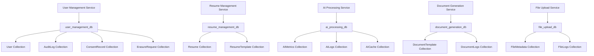

# Microservices Database Design

This document outlines the DB-first MongoDB schemas for the 5 microservices in the CareerVerve application. Each service has its own separate database to ensure independence. Schemas include data validation, encryption for sensitive fields, and compliance considerations.

## Architecture Overview



## 1. User Management Service

**Database:** `user_management_db`

### User Collection Schema
```javascript
{
  _id: ObjectId,
  email: {
    type: String,
    required: true,
    unique: true,
    validate: /^[^\s@]+@[^\s@]+\.[^\s@]+$/,
    maxlength: 254
  },
  name: {
    type: String,
    maxlength: 100
  },
  privacyMode: {
    type: Boolean,
    default: false
  },
  createdAt: {
    type: Date,
    default: Date.now,
    immutable: true
  },
  updatedAt: {
    type: Date,
    default: Date.now
  }
}
```

**Indexes:**
- Unique index on `email`
- Index on `createdAt` (descending)

**Encryption:** None required (email is not sensitive per se, but consider hashing if needed for privacy).

### AuditLog Collection Schema
```javascript
{
  _id: ObjectId,
  userId: {
    type: ObjectId,
    ref: 'User',
    index: true
  },
  action: {
    type: String,
    required: true,
    enum: ['access', 'modify', 'delete', 'export', 'consent_granted', 'consent_withdrawn']
  },
  resourceType: {
    type: String,
    required: true,
    enum: ['user', 'resume', 'consent']
  },
  resourceId: {
    type: String,
    required: true,
    index: true
  },
  timestamp: {
    type: Date,
    required: true,
    default: Date.now,
    index: true
  },
  ipAddress: {
    type: String,
    required: true,
    encrypted: true
  },
  userAgent: {
    type: String,
    required: true,
    encrypted: true
  },
  performedBy: {
    type: String,
    required: true,
    index: true
  },
  details: String,
  createdAt: {
    type: Date,
    default: Date.now,
    immutable: true
  }
}
```

**Indexes:**
- Compound index on `userId` and `timestamp` (descending)
- Index on `action` and `timestamp` (descending)
- Compound index on `resourceType`, `resourceId`, and `timestamp` (descending)

**Encryption:** `ipAddress`, `userAgent` (AES-256)

**Immutability:** Collection is append-only; no updates or deletes allowed.

### ConsentRecord Collection Schema
```javascript
{
  _id: ObjectId,
  userId: {
    type: ObjectId,
    ref: 'User',
    required: true,
    index: true
  },
  purpose: {
    type: String,
    required: true,
    enum: ['account_management', 'resume_building', 'analytics', 'marketing', 'legal_compliance']
  },
  status: {
    type: String,
    required: true,
    enum: ['granted', 'denied', 'withdrawn', 'expired'],
    default: 'granted'
  },
  grantedAt: {
    type: Date,
    required: true,
    default: Date.now
  },
  expiresAt: Date,
  withdrawnAt: Date,
  ipAddress: {
    type: String,
    required: true,
    encrypted: true
  },
  userAgent: {
    type: String,
    required: true,
    encrypted: true
  },
  createdAt: {
    type: Date,
    default: Date.now,
    immutable: true
  },
  updatedAt: {
    type: Date,
    default: Date.now
  }
}
```

**Indexes:**
- Compound index on `userId` and `purpose`
- Compound index on `status` and `expiresAt`

**Encryption:** `ipAddress`, `userAgent`

### ErasureRequest Collection Schema
```javascript
{
  _id: ObjectId,
  userId: {
    type: ObjectId,
    ref: 'User',
    required: true,
    index: true
  },
  requestId: {
    type: String,
    required: true,
    unique: true,
    index: true
  },
  reason: {
    type: String,
    required: true
  },
  status: {
    type: String,
    required: true,
    enum: ['pending', 'processing', 'completed', 'failed'],
    default: 'pending'
  },
  requestedAt: {
    type: Date,
    required: true,
    default: Date.now
  },
  completedAt: Date,
  ipAddress: {
    type: String,
    required: true,
    encrypted: true
  },
  userAgent: {
    type: String,
    required: true,
    encrypted: true
  },
  estimatedCompletion: {
    type: Date,
    required: true
  },
  createdAt: {
    type: Date,
    default: Date.now,
    immutable: true
  },
  updatedAt: {
    type: Date,
    default: Date.now
  }
}
```

**Indexes:**
- Compound index on `userId` and `status`
- Index on `status` and `requestedAt` (descending)

**Encryption:** `ipAddress`, `userAgent`

## 2. Resume Management Service

**Database:** `resume_management_db`

### Resume Collection Schema
```javascript
{
  _id: ObjectId,
  userId: {
    type: ObjectId,
    required: true,
    index: true
  },
  title: {
    type: String,
    required: true,
    maxlength: 100
  },
  content: {
    type: String,
    required: true,
    encrypted: true
  },
  locale: {
    type: String,
    required: true
  },
  version: {
    type: Number,
    default: 1
  },
  photos: {
    type: String,
    encrypted: true
  },
  certifications: {
    type: String,
    encrypted: true
  },
  hobbies: {
    type: String,
    encrypted: true
  },
  references: {
    type: String,
    encrypted: true
  },
  comments: [{
    field: {
      type: String,
      required: true
    },
    text: {
      type: String,
      required: true
    },
    author: {
      type: String,
      required: true
    },
    createdAt: {
      type: Date,
      default: Date.now
    },
    updatedAt: {
      type: Date,
      default: Date.now
    }
  }],
  createdAt: {
    type: Date,
    default: Date.now,
    immutable: true
  },
  updatedAt: {
    type: Date,
    default: Date.now
  }
}
```

**Indexes:**
- Index on `userId`
- Index on `locale`
- Index on `createdAt` (descending)
- Index on `updatedAt` (descending)
- Compound index on `locale` and `createdAt` (descending)

**Encryption:** `content`, `photos`, `certifications`, `hobbies`, `references`

### ResumeTemplate Collection Schema
```javascript
{
  _id: ObjectId,
  name: {
    type: String,
    required: true,
    unique: true
  },
  description: String,
  structure: {
    type: Object,
    required: true
  },
  locale: {
    type: String,
    required: true
  },
  isActive: {
    type: Boolean,
    default: true
  },
  createdAt: {
    type: Date,
    default: Date.now,
    immutable: true
  },
  updatedAt: {
    type: Date,
    default: Date.now
  }
}
```

**Indexes:**
- Unique index on `name`
- Index on `locale`
- Index on `isActive`

## 3. AI Processing Service

**Database:** `ai_processing_db`

### AIMetrics Collection Schema
```javascript
{
  _id: ObjectId,
  userId: {
    type: ObjectId,
    index: true
  },
  operation: {
    type: String,
    required: true,
    enum: ['lint', 'rewrite', 'suggestions']
  },
  responseTime: {
    type: Number,
    required: true,
    min: 0
  },
  tokenUsage: {
    type: Number,
    required: true,
    min: 0
  },
  accuracyScore: {
    type: Number,
    min: 0,
    max: 1
  },
  timestamp: {
    type: Date,
    required: true,
    default: Date.now,
    index: true
  },
  model: String,
  createdAt: {
    type: Date,
    default: Date.now,
    immutable: true
  }
}
```

**Indexes:**
- Index on `userId` and `timestamp` (descending)
- Index on `operation` and `timestamp` (descending)

### AILogs Collection Schema
```javascript
{
  _id: ObjectId,
  userId: {
    type: ObjectId,
    index: true
  },
  operation: {
    type: String,
    required: true
  },
  action: {
    type: String,
    required: true
  },
  timestamp: {
    type: Date,
    required: true,
    default: Date.now,
    index: true
  },
  details: Object,
  error: String,
  createdAt: {
    type: Date,
    default: Date.now,
    immutable: true
  }
}
```

**Indexes:**
- Index on `userId` and `timestamp` (descending)
- Index on `operation` and `timestamp` (descending)

**Encryption:** `details` if contains sensitive data

### AICache Collection Schema
```javascript
{
  _id: ObjectId,
  key: {
    type: String,
    required: true,
    unique: true
  },
  value: {
    type: Object,
    required: true,
    encrypted: true
  },
  ttl: {
    type: Date,
    required: true,
    index: true,
    expireAfterSeconds: 0
  },
  createdAt: {
    type: Date,
    default: Date.now,
    immutable: true
  }
}
```

**Indexes:**
- Unique index on `key`
- TTL index on `ttl`

**Encryption:** `value`

## 4. Document Generation Service

**Database:** `document_generation_db`

### DocumentTemplate Collection Schema
```javascript
{
  _id: ObjectId,
  name: {
    type: String,
    required: true,
    unique: true
  },
  type: {
    type: String,
    required: true,
    enum: ['pdf', 'docx', 'html']
  },
  content: {
    type: String,
    required: true
  },
  variables: [String],
  locale: {
    type: String,
    required: true
  },
  isActive: {
    type: Boolean,
    default: true
  },
  createdAt: {
    type: Date,
    default: Date.now,
    immutable: true
  },
  updatedAt: {
    type: Date,
    default: Date.now
  }
}
```

**Indexes:**
- Unique index on `name`
- Index on `type`
- Index on `locale`
- Index on `isActive`

### DocumentLogs Collection Schema
```javascript
{
  _id: ObjectId,
  userId: {
    type: ObjectId,
    index: true
  },
  templateId: {
    type: ObjectId,
    index: true
  },
  action: {
    type: String,
    required: true,
    enum: ['generate', 'export', 'preview']
  },
  status: {
    type: String,
    required: true,
    enum: ['success', 'error']
  },
  timestamp: {
    type: Date,
    required: true,
    default: Date.now,
    index: true
  },
  details: Object,
  error: String,
  createdAt: {
    type: Date,
    default: Date.now,
    immutable: true
  }
}
```

**Indexes:**
- Index on `userId` and `timestamp` (descending)
- Index on `templateId` and `timestamp` (descending)

## 5. File Upload Service

**Database:** `file_upload_db`

### FileMetadata Collection Schema
```javascript
{
  _id: ObjectId,
  userId: {
    type: ObjectId,
    required: true,
    index: true
  },
  filename: {
    type: String,
    required: true
  },
  originalName: {
    type: String,
    required: true
  },
  mimeType: {
    type: String,
    required: true
  },
  size: {
    type: Number,
    required: true,
    min: 0
  },
  path: {
    type: String,
    required: true,
    encrypted: true
  },
  checksum: {
    type: String,
    required: true
  },
  uploadedAt: {
    type: Date,
    required: true,
    default: Date.now
  },
  createdAt: {
    type: Date,
    default: Date.now,
    immutable: true
  },
  updatedAt: {
    type: Date,
    default: Date.now
  }
}
```

**Indexes:**
- Index on `userId` and `uploadedAt` (descending)
- Index on `checksum`

**Encryption:** `path`

### FileLogs Collection Schema
```javascript
{
  _id: ObjectId,
  userId: {
    type: ObjectId,
    index: true
  },
  fileId: {
    type: ObjectId,
    index: true
  },
  action: {
    type: String,
    required: true,
    enum: ['upload', 'download', 'delete', 'access']
  },
  status: {
    type: String,
    required: true,
    enum: ['success', 'error']
  },
  timestamp: {
    type: Date,
    required: true,
    default: Date.now,
    index: true
  },
  ipAddress: {
    type: String,
    encrypted: true
  },
  userAgent: {
    type: String,
    encrypted: true
  },
  details: Object,
  error: String,
  createdAt: {
    type: Date,
    default: Date.now,
    immutable: true
  }
}
```

**Indexes:**
- Index on `userId` and `timestamp` (descending)
- Index on `fileId` and `timestamp` (descending)

**Encryption:** `ipAddress`, `userAgent`

# Migration Scripts and Rollback Strategies

## Migration Approach

Migrations follow a phased approach:
1. Create new databases and collections
2. Migrate data from monolithic database
3. Validate data integrity
4. Switch traffic to microservices
5. Monitor and rollback if needed

## User Management Service Migration

### Forward Migration Script
```javascript
// Create database
use user_management_db

// Create collections with schemas
db.createCollection("users", {
  validator: { $jsonSchema: { /* User schema */ } }
})
db.createCollection("auditlogs", {
  validator: { $jsonSchema: { /* AuditLog schema */ } }
})
db.createCollection("consentrecords", {
  validator: { $jsonSchema: { /* ConsentRecord schema */ } }
})
db.createCollection("erasurerequests", {
  validator: { $jsonSchema: { /* ErasureRequest schema */ } }
})

// Migrate data from monolithic DB
// (ETL process to extract, transform, load data)
```

### Rollback Script
```javascript
// Drop the new database
db.getSiblingDB("user_management_db").dropDatabase()

// Redirect to monolithic DB
// (Update service configuration)
```

## Resume Management Service Migration

### Forward Migration Script
```javascript
use resume_management_db

db.createCollection("resumes", {
  validator: { $jsonSchema: { /* Resume schema with userId */ } }
})
db.createCollection("resumetemplates", {
  validator: { $jsonSchema: { /* ResumeTemplate schema */ } }
})

// Migrate resumes, adding userId from existing data
// Migrate templates
```

### Rollback Script
```javascript
db.getSiblingDB("resume_management_db").dropDatabase()
```

## AI Processing Service Migration

### Forward Migration Script
```javascript
use ai_processing_db

db.createCollection("aimetrics", {
  validator: { $jsonSchema: { /* AIMetrics schema */ } }
})
db.createCollection("ailogs", {
  validator: { $jsonSchema: { /* AILogs schema */ } }
})
db.createCollection("aicache", {
  validator: { $jsonSchema: { /* AICache schema */ } }
})

// Migrate existing AI-related data if any
```

### Rollback Script
```javascript
db.getSiblingDB("ai_processing_db").dropDatabase()
```

## Document Generation Service Migration

### Forward Migration Script
```javascript
use document_generation_db

db.createCollection("documenttemplates", {
  validator: { $jsonSchema: { /* DocumentTemplate schema */ } }
})
db.createCollection("documentlogs", {
  validator: { $jsonSchema: { /* DocumentLogs schema */ } }
})

// Migrate templates and logs
```

### Rollback Script
```javascript
db.getSiblingDB("document_generation_db").dropDatabase()
```

## File Upload Service Migration

### Forward Migration Script
```javascript
use file_upload_db

db.createCollection("filemetadata", {
  validator: { $jsonSchema: { /* FileMetadata schema */ } }
})
db.createCollection("filelogs", {
  validator: { $jsonSchema: { /* FileLogs schema */ } }
})

// Migrate file metadata and logs
```

### Rollback Script
```javascript
db.getSiblingDB("file_upload_db").dropDatabase()
```

## General Migration Considerations

- **Data Backups:** Full backups before each migration
- **Validation:** Post-migration data integrity checks
- **Parallel Run:** Keep monolithic running during transition
- **Gradual Rollout:** 10% traffic initially, increase gradually
- **Monitoring:** Comprehensive monitoring during migration
- **Rollback Window:** 30 days post-migration for rollback capability

## Compliance and Security Notes

- All sensitive fields use AES-256 encryption
- Audit logs are immutable and append-only
- User data isolation across services
- GDPR compliance with erasure capabilities
- Input validation on all fields
- No shared databases between services